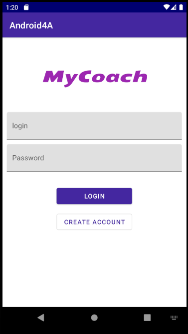
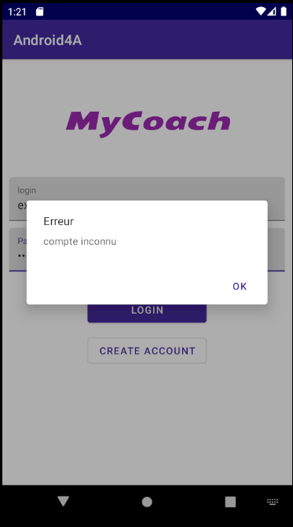
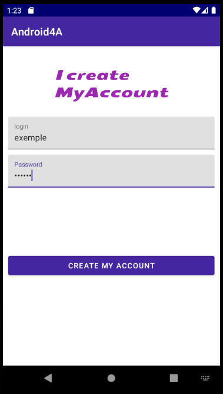
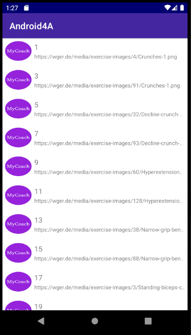
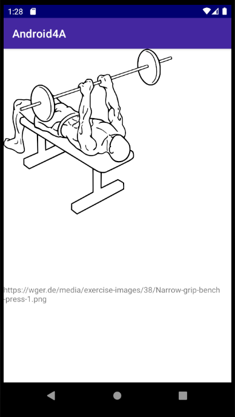

# Projet_App_4A
## Présentation :
Projet sur une application mobile sous android codé en Kotlin, gérant une base de donnée d'utilisateur avec login et mot de passe.
L'application refuse l'accès si l'utilisateur n'est pas connu de la BDD et donne la possibilité de créer un compte.
L'utilisateur connu, il peut se logger à l'application "MyCoach".
L'application affiche une liste d'élements et son détail lorsque l'on clique sur l'élement.
Cette application affiche les images de differents exercices selon l'identifiant donnée. Il utilise l'API du site Workout Manager : "https://wger.de".
Ainsi cette application permet d'aider une personne à exercer le mouvement d'un exercice.

## Prérequis :
- Installation d'Android Studio
- Utilisation d'une API :
"https://wger.de/api/v2/exerciseimage/"
- Création d'une Base de Donnée

## Consigne respectées :
- Language Kotlin
- Architecture MVVM
- Clean Architecture
- Utilisation d’une réelle BDD
- Appel WebService à une API REST
- Affichage d'une liste dans un recyclerView
- Affichage du détail d'un item de la liste (String + image)
- Stockage de données en cache
- Utilisation de Gitflow
- Utilisation de 4 écran (login, create account, list, detail)
- Design

## Fonctionnalités :
### Premier écran
- Page de connexion.

            

### deuxième écran
- Page de creation de compte

 

### Troisième écran
- Liste de RecyclerView.

### Quatrième écran
- Détail de l'élement (Image + URL)

